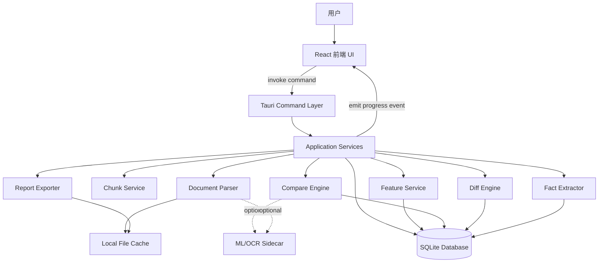
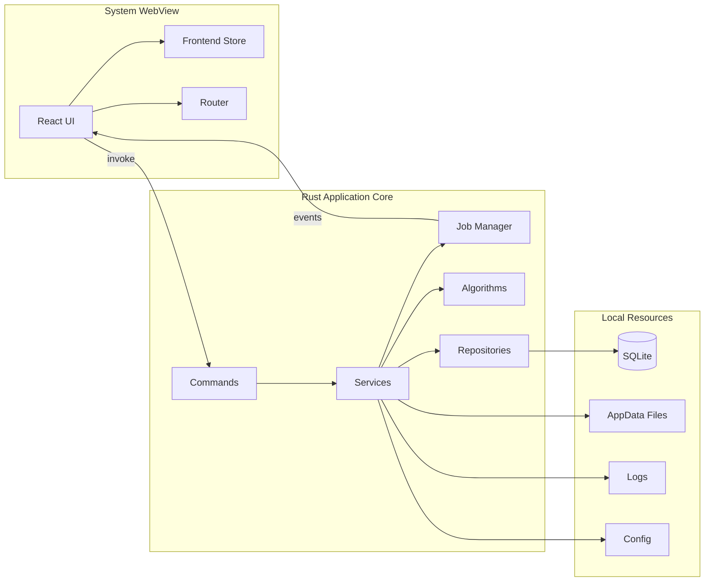
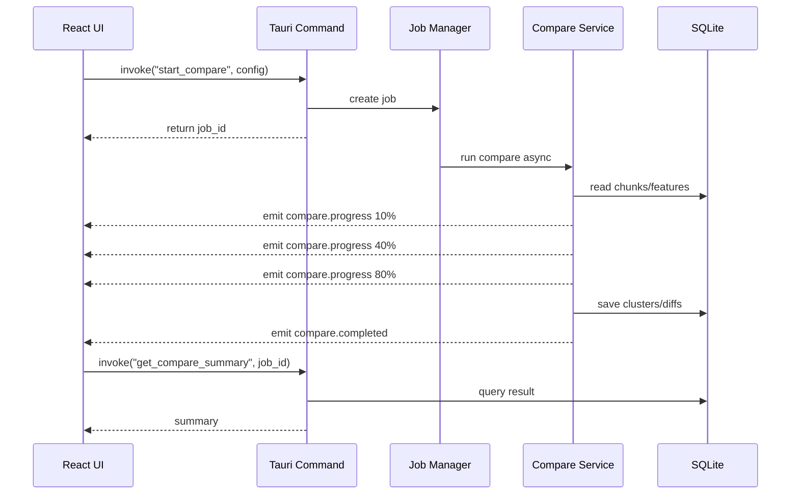
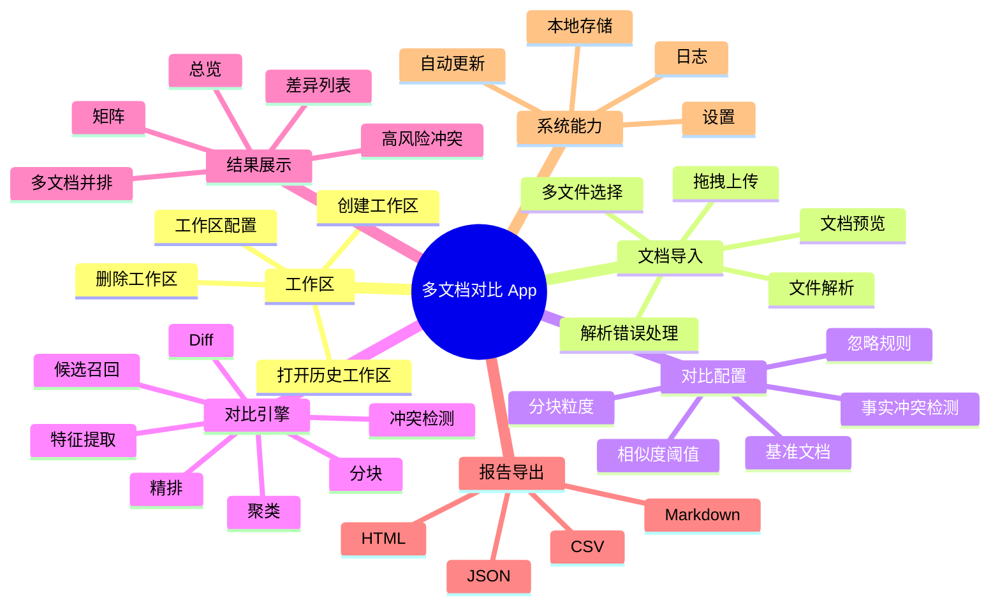
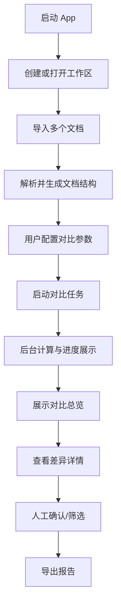
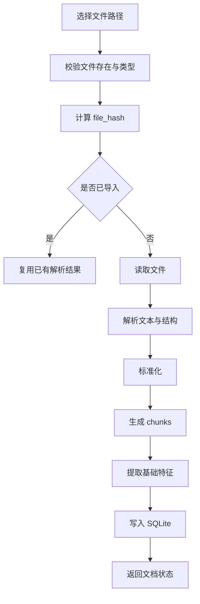
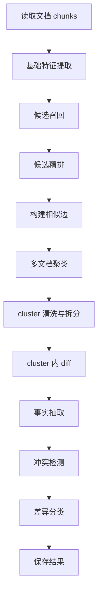
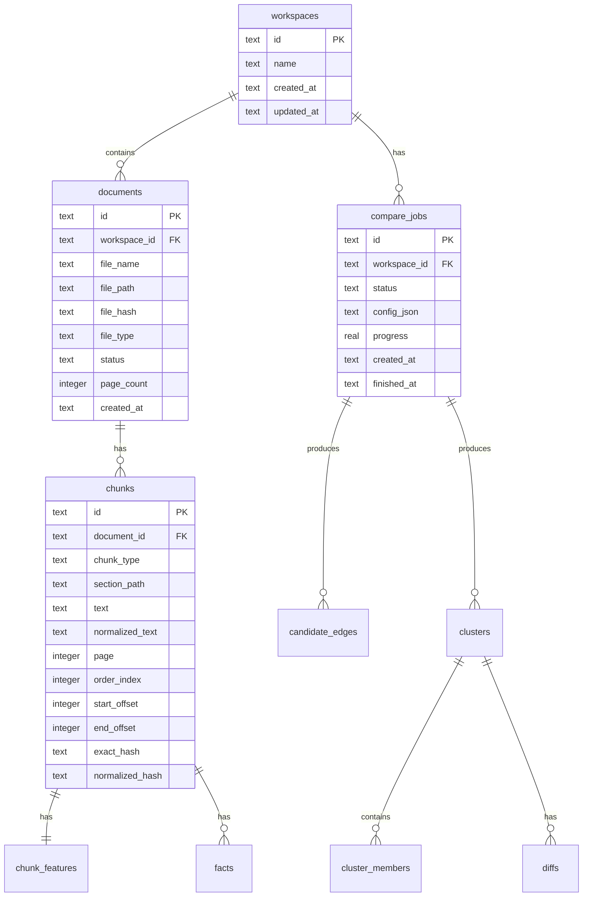
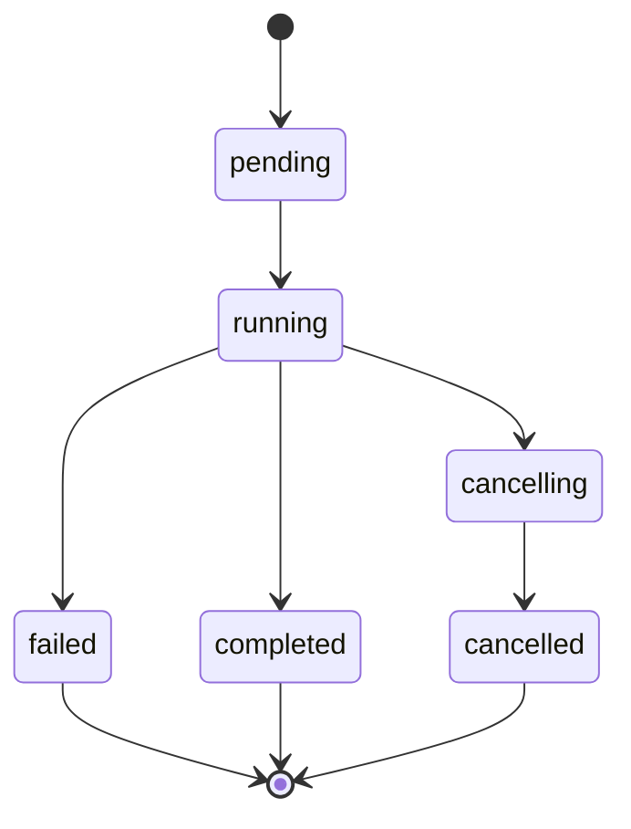
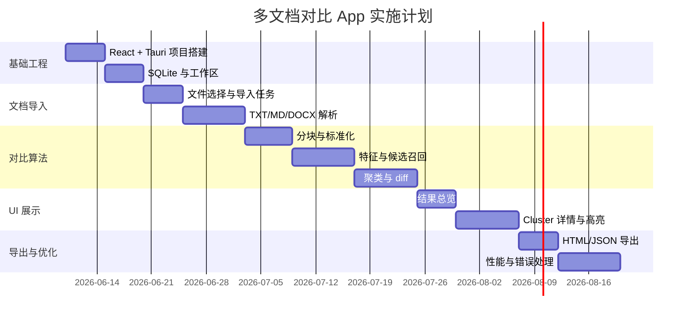

# 多文档对比桌面 App 系统架构设计与详细设计方案

> 技术栈：React + TypeScript + Vite + Tauri v2 + Rust + SQLite  
> 文档版本：v1.0  
> 编写日期：2026-06-10  
> 目标形态：本地优先的跨平台桌面应用，支持多文档导入、结构化对比、差异可视化、冲突检测与报告导出。

---

## 1. 文档说明

### 1.1 背景

传统文档对比工具通常以“两份文档全文 diff”为核心，适合发现逐字变化，但在以下场景中效果有限：

- 同一内容在不同文档中出现顺序调整；
- 多份文档之间存在相同、相似、改写、缺失、冲突等复杂关系；
- 合同、政策、报告中存在金额、日期、期限、主体、义务等结构化事实差异；
- 用户需要一次性比较 3 份、5 份甚至更多文档，而不是两两手工比较；
- 用户希望在本地完成处理，避免敏感文档上传云端。

因此，本方案设计一个基于 React + Tauri 的本地桌面 App，将文档解析、分块、相似度匹配、多文档聚类、差异归因和报告生成整合到一个完整系统中。

### 1.2 设计目标

系统需要实现：

1. 多文档导入：支持 TXT、Markdown、DOCX、PDF 等常见格式；
2. 文档结构化：解析标题、段落、列表、表格、页码、章节路径；
3. 多文档对比：支持 2 份以上文档的统一对齐，而不是仅做两两 diff；
4. 差异分类：识别相同、轻微修改、改写、新增、删除、冲突、不确定；
5. 事实冲突检测：识别金额、日期、期限、比例、主体、义务等关键字段冲突；
6. 可视化展示：提供多文档并排视图、差异高亮、冲突面板、过滤排序；
7. 本地存储：使用 SQLite 缓存文档、分块、特征、任务、结果；
8. 报告导出：支持 HTML、Markdown、JSON，后续扩展 PDF、DOCX；
9. 桌面体验：跨平台运行，支持系统文件选择器、本地文件读写、自动更新；
10. 安全可控：本地优先、最小权限、敏感数据不默认上传。

### 1.3 非目标范围

MVP 阶段不强制实现：

- 云端协作；
- 用户账号体系；
- 多人实时编辑；
- 完整 OCR；
- 大模型自动法律审查；
- 企业级权限中心；
- 移动端 App；
- 全格式版面还原。

这些能力可作为后续版本扩展。

---

## 2. 技术选型

### 2.1 前端技术栈

| 技术 | 用途 | 说明 |
|---|---|---|
| React | UI 构建 | 组件化开发，适合复杂交互界面 |
| TypeScript | 类型安全 | 约束前后端 DTO、状态、配置 |
| Vite | 构建工具 | 快速开发服务器与打包 |
| Zustand / Redux Toolkit | 状态管理 | 推荐 Zustand 用于轻量状态，Redux Toolkit 用于复杂全局状态 |
| TanStack Query | 异步数据 | 用于 command 查询结果缓存、分页、刷新 |
| React Router | 路由 | 多页面结构 |
| Ant Design / Mantine / shadcn/ui | UI 组件 | 任选其一，建议统一设计系统 |
| react-window / react-virtualized | 虚拟列表 | 大量 diff 结果展示 |
| monaco-editor，可选 | 文本视图 | 用于大文本高亮与定位 |

React 官方将 UI 拆成组件进行构建，Vite 官方支持包括 TypeScript 在内的项目模板；因此本系统采用 React + TypeScript + Vite 作为前端基础。

### 2.2 桌面与后端技术栈

| 技术 | 用途 | 说明 |
|---|---|---|
| Tauri v2 | 桌面容器 | 使用系统 WebView 渲染前端，Rust 负责后端能力 |
| Rust | 本地核心逻辑 | 文件处理、算法计算、数据库、导出 |
| SQLite | 本地数据库 | 工作区、文档、分块、特征、任务、结果缓存 |
| sqlx / rusqlite | Rust 数据库访问 | 推荐 sqlx，便于迁移与异步 |
| tauri-plugin-dialog | 文件选择 / 保存 | 打开文件、保存报告 |
| tauri-plugin-opener | 打开导出文件 | 用系统默认程序打开报告 |
| tauri-plugin-updater | 自动更新 | 生产发布后使用 |
| tauri-plugin-fs | 可选文件系统 API | 推荐核心读写仍放 Rust 端 |
| sidecar | 可选外部算法进程 | OCR、本地 embedding、Python 解析器 |

Tauri v2 支持任意可编译为 HTML、JS、CSS 的前端框架，并允许前端通过 IPC 与 Rust 后端交互；本系统采用“React 负责交互，Rust 负责本地能力与计算”的分层方案。

### 2.3 为什么不把算法放在 React 前端

不建议将解析、索引、相似度计算、聚类全部放在 React 中，原因如下：

1. 文档可能很大，前端内存和线程控制不如 Rust 稳定；
2. 文件路径、文件读写和缓存更适合在 Rust 端统一处理；
3. 多文档相似度计算属于 CPU 密集型任务，Rust 更适合；
4. 前端传输大文本到后端会造成 IPC 压力；
5. Rust 端更便于接入 SQLite、导出文件、任务取消和并发控制；
6. 安全模型更清晰：前端只发起命令，核心权限集中在后端。

---

## 3. 系统总体架构

### 3.1 总体架构图



### 3.2 分层说明

| 层 | 名称 | 职责 |
|---|---|---|
| L1 | React Presentation Layer | 页面、组件、交互、状态展示、结果可视化 |
| L2 | Tauri IPC Layer | 前端 invoke、事件监听、命令入口 |
| L3 | Application Service Layer | 编排导入、对比、导出、任务、配置 |
| L4 | Domain Algorithm Layer | 文档分块、特征提取、相似度、聚类、diff、事实冲突 |
| L5 | Infrastructure Layer | SQLite、文件系统、日志、配置、sidecar、自动更新 |

### 3.3 架构原则

1. **本地优先**：默认不上传原始文档；
2. **前后端职责分离**：React 不直接处理重计算；
3. **可缓存**：文档解析、分块、特征、对比结果均可缓存；
4. **可扩展**：MVP 用 TF-IDF / n-gram，高级版接入 embedding；
5. **可中断**：大任务支持进度、取消、失败恢复；
6. **可解释**：每个差异都应能追溯到原文 chunk；
7. **最小权限**：仅开启必要的 Tauri 权限和插件；
8. **跨平台**：Windows、macOS、Linux 作为主要目标。

---

## 4. 运行时架构

### 4.1 App 运行时组件



### 4.2 IPC 交互模式

系统采用两类通信模式：

1. **Command 请求/响应**  
   用于确定性操作，例如创建工作区、导入文档、启动对比、查询结果。

2. **Event 进度推送**  
   用于长任务状态，例如解析进度、匹配进度、导出完成、任务失败。



---

## 5. 产品功能架构

### 5.1 功能模块总览



### 5.2 核心用户流程



---

## 6. 详细模块设计：React 前端

### 6.1 前端目录结构

```text
src/
  app/
    App.tsx
    router.tsx
    providers.tsx

  pages/
    WorkspaceListPage.tsx
    WorkspaceDetailPage.tsx
    ImportDocumentsPage.tsx
    CompareSetupPage.tsx
    CompareRunningPage.tsx
    CompareResultPage.tsx
    ClusterDetailPage.tsx
    SettingsPage.tsx

  components/
    layout/
      AppShell.tsx
      Sidebar.tsx
      Topbar.tsx
    workspace/
      WorkspaceCard.tsx
      WorkspaceCreateDialog.tsx
    document/
      FileDropzone.tsx
      DocumentList.tsx
      DocumentPreview.tsx
      ParseStatusBadge.tsx
    compare/
      CompareConfigForm.tsx
      CompareProgressPanel.tsx
      CompareSummaryCards.tsx
      SimilarityMatrix.tsx
      ClusterList.tsx
      ClusterFilters.tsx
      DiffViewer.tsx
      MultiDocSideBySide.tsx
      FactConflictPanel.tsx
    export/
      ExportDialog.tsx
      ExportHistory.tsx
    common/
      EmptyState.tsx
      ErrorView.tsx
      Loading.tsx

  services/
    tauriClient.ts
    workspaceApi.ts
    documentApi.ts
    compareApi.ts
    exportApi.ts
    settingsApi.ts

  stores/
    workspaceStore.ts
    jobStore.ts
    compareStore.ts
    settingsStore.ts

  hooks/
    useTauriEvent.ts
    useCompareProgress.ts
    useWorkspace.ts
    useClusterPagination.ts

  types/
    workspace.ts
    document.ts
    compare.ts
    diff.ts
    export.ts
    settings.ts

  utils/
    format.ts
    score.ts
    diffColor.ts
```

### 6.2 页面设计

#### 6.2.1 WorkspaceListPage

职责：

- 展示最近工作区；
- 创建新工作区；
- 打开已有工作区；
- 删除工作区；
- 展示最近对比任务状态。

主要组件：

- `WorkspaceCard`
- `WorkspaceCreateDialog`
- `RecentJobList`

#### 6.2.2 WorkspaceDetailPage

职责：

- 展示工作区内文档列表；
- 展示历史对比任务；
- 提供导入、重新对比、导出入口。

核心状态：

```ts
type WorkspaceDetailState = {
  workspaceId: string;
  documents: DocumentSummary[];
  compareJobs: CompareJobSummary[];
  selectedDocumentIds: string[];
};
```

#### 6.2.3 ImportDocumentsPage

职责：

- 拖拽或选择多个文件；
- 显示导入进度；
- 展示解析成功/失败；
- 支持失败重试。

交互流程：

```text
选择文件路径
→ invoke import_documents
→ 监听 document.import.progress
→ 刷新文档列表
```

#### 6.2.4 CompareSetupPage

职责：

- 选择参与对比的文档；
- 设置基准文档；
- 配置相似度阈值；
- 是否启用事实冲突检测；
- 是否启用语义向量；
- 设置忽略规则。

配置类型：

```ts
type CompareConfig = {
  documentIds: string[];
  baseDocumentId?: string;
  chunkLevel: 'section' | 'paragraph' | 'sentence';
  similarityThreshold: number;
  candidateTopK: number;
  enableSemantic: boolean;
  enableFactConflict: boolean;
  ignoreWhitespace: boolean;
  ignorePunctuation: boolean;
  ignoreCase: boolean;
  detectMovedParagraph: boolean;
  language: 'zh' | 'en' | 'auto';
};
```

#### 6.2.5 CompareResultPage

职责：

- 展示总览统计；
- 展示文档相似度矩阵；
- 展示差异分类分布；
- 展示 cluster 列表；
- 提供过滤、排序、跳转详情。

总览指标：

```ts
type CompareSummary = {
  documentCount: number;
  chunkCount: number;
  clusterCount: number;
  sameCount: number;
  minorChangeCount: number;
  rewriteCount: number;
  changedCount: number;
  addedCount: number;
  deletedCount: number;
  conflictCount: number;
  uncertainCount: number;
};
```

#### 6.2.6 ClusterDetailPage

职责：

- 多文档并排展示；
- 局部 diff 高亮；
- 展示事实字段差异；
- 标记人工确认状态；
- 跳转原始文档位置。

布局建议：

```text
┌───────────────────────┬────────────────────────────────────┐
│ Cluster 列表 / 过滤器  │ 多文档并排对比视图                 │
│                       ├────────────────────────────────────┤
│                       │ 事实冲突 / 风险解释 / 人工确认      │
└───────────────────────┴────────────────────────────────────┘
```

---

## 7. 详细模块设计：Tauri / Rust 后端

### 7.1 Rust 后端目录结构

```text
src-tauri/
  src/
    main.rs
    lib.rs

    commands/
      mod.rs
      workspace_commands.rs
      document_commands.rs
      compare_commands.rs
      export_commands.rs
      settings_commands.rs

    app/
      app_state.rs
      bootstrap.rs
      config.rs

    domain/
      workspace.rs
      document.rs
      chunk.rs
      feature.rs
      compare.rs
      diff.rs
      fact.rs
      job.rs
      export.rs

    services/
      workspace_service.rs
      import_service.rs
      parser_service.rs
      chunk_service.rs
      feature_service.rs
      compare_service.rs
      diff_service.rs
      fact_service.rs
      export_service.rs
      settings_service.rs

    algorithms/
      normalize.rs
      tokenizer.rs
      ngram.rs
      hash.rs
      tfidf.rs
      minhash.rs
      similarity.rs
      candidate.rs
      clustering.rs
      diff.rs
      fact_extract.rs
      fact_compare.rs

    storage/
      db.rs
      migrations.rs
      repositories/
        workspace_repository.rs
        document_repository.rs
        chunk_repository.rs
        compare_repository.rs
        job_repository.rs

    jobs/
      job_manager.rs
      job_runner.rs
      progress.rs
      cancellation.rs

    io/
      file_hash.rs
      app_dirs.rs
      report_writer.rs
      document_loader.rs

    errors/
      app_error.rs
      result.rs

    telemetry/
      logger.rs
      metrics.rs
```

### 7.2 AppState 设计

```rust
pub struct AppState {
    pub db: Database,
    pub job_manager: JobManager,
    pub services: Services,
    pub config: AppConfig,
}
```

建议使用 Tauri 的 state 管理能力在 commands 中访问共享状态。共享可变状态需要使用 `Arc`、`Mutex`、`RwLock` 或任务队列进行控制。

### 7.3 Command 设计

#### 工作区 Commands

```rust
#[tauri::command]
async fn create_workspace(name: String, state: tauri::State<'_, AppState>) -> Result<WorkspaceDto, AppError>;

#[tauri::command]
async fn list_workspaces(state: tauri::State<'_, AppState>) -> Result<Vec<WorkspaceDto>, AppError>;

#[tauri::command]
async fn get_workspace(workspace_id: String, state: tauri::State<'_, AppState>) -> Result<WorkspaceDetailDto, AppError>;

#[tauri::command]
async fn delete_workspace(workspace_id: String, state: tauri::State<'_, AppState>) -> Result<(), AppError>;
```

#### 文档 Commands

```rust
#[tauri::command]
async fn import_documents(
    workspace_id: String,
    paths: Vec<String>,
    app: tauri::AppHandle,
    state: tauri::State<'_, AppState>,
) -> Result<JobDto, AppError>;

#[tauri::command]
async fn list_documents(
    workspace_id: String,
    state: tauri::State<'_, AppState>,
) -> Result<Vec<DocumentDto>, AppError>;

#[tauri::command]
async fn get_document_preview(
    document_id: String,
    state: tauri::State<'_, AppState>,
) -> Result<DocumentPreviewDto, AppError>;

#[tauri::command]
async fn remove_document(
    document_id: String,
    state: tauri::State<'_, AppState>,
) -> Result<(), AppError>;
```

#### 对比 Commands

```rust
#[tauri::command]
async fn start_compare(
    workspace_id: String,
    config: CompareConfigDto,
    app: tauri::AppHandle,
    state: tauri::State<'_, AppState>,
) -> Result<JobDto, AppError>;

#[tauri::command]
async fn cancel_job(
    job_id: String,
    state: tauri::State<'_, AppState>,
) -> Result<(), AppError>;

#[tauri::command]
async fn get_compare_summary(
    job_id: String,
    state: tauri::State<'_, AppState>,
) -> Result<CompareSummaryDto, AppError>;

#[tauri::command]
async fn list_clusters(
    job_id: String,
    filter: ClusterFilterDto,
    page: PageRequestDto,
    state: tauri::State<'_, AppState>,
) -> Result<PageResult<ClusterSummaryDto>, AppError>;

#[tauri::command]
async fn get_cluster_detail(
    cluster_id: String,
    state: tauri::State<'_, AppState>,
) -> Result<ClusterDetailDto, AppError>;
```

#### 导出 Commands

```rust
#[tauri::command]
async fn export_report(
    job_id: String,
    format: ExportFormatDto,
    output_path: String,
    state: tauri::State<'_, AppState>,
) -> Result<ExportResultDto, AppError>;
```

### 7.4 Event 设计

事件命名建议统一为：

```text
document.import.progress
document.import.completed
document.import.failed
compare.progress
compare.completed
compare.failed
compare.cancelled
export.completed
export.failed
```

进度 payload：

```ts
type JobProgressEvent = {
  jobId: string;
  jobType: 'import' | 'compare' | 'export';
  stage: string;
  message: string;
  current: number;
  total: number;
  percent: number;
};
```

---

## 8. 文档导入与解析设计

### 8.1 支持格式

| 格式 | MVP 支持 | 解析策略 |
|---|---:|---|
| TXT | 是 | 直接读取文本 |
| Markdown | 是 | 保留标题层级，正文按段落拆分 |
| DOCX | 是 | 解压 OOXML，抽取段落、标题、表格 |
| PDF | 部分 | 文本型 PDF 抽取文本，复杂 PDF 后续增强 |
| HTML | 可选 | DOM 转文本，保留标题和表格 |
| XLSX | 后续 | sheet / row / cell 结构化 |
| 图片 / 扫描 PDF | 后续 | OCR sidecar |

### 8.2 导入流程



### 8.3 文本标准化规则

标准化目标是降低无意义差异对比对结果的影响。

规则：

1. Unicode 规范化；
2. 全角半角统一；
3. 连续空白压缩；
4. 换行归一化；
5. 标点归一化；
6. 数字格式归一化；
7. 中文日期归一化；
8. 页眉页脚候选清理；
9. 可配置是否忽略大小写；
10. 可配置是否忽略标点。

示例：

```text
甲方应在每月十日前支付服务费用。
甲方 应 在 每月 10 日前 支付 服务费用
```

可归一化为：

```text
甲方应在每月10日前支付服务费用
```

### 8.4 分块策略

系统支持三种主要分块粒度：

| 粒度 | 说明 | 使用场景 |
|---|---|---|
| section | 章节级 | 文档结构对齐、快速总览 |
| paragraph | 段落级 | 默认对比单位 |
| sentence | 句子级 | 局部 diff、事实抽取 |

chunk 类型：

```rust
pub enum ChunkType {
    Heading,
    Section,
    Paragraph,
    Sentence,
    ListItem,
    Table,
    TableRow,
    TableCell,
}
```

chunk 数据结构：

```rust
pub struct Chunk {
    pub id: String,
    pub document_id: String,
    pub chunk_type: ChunkType,
    pub section_path: Vec<String>,
    pub text: String,
    pub normalized_text: String,
    pub page: Option<i32>,
    pub order_index: i32,
    pub start_offset: Option<i64>,
    pub end_offset: Option<i64>,
    pub exact_hash: String,
    pub normalized_hash: String,
}
```

---

## 9. 多文档对比算法详细设计

### 9.1 算法总体流程



### 9.2 特征提取

每个 chunk 生成以下特征：

| 特征 | 类型 | 用途 |
|---|---|---|
| exact_hash | String | 快速判断完全相同 |
| normalized_hash | String | 判断忽略格式后的相同 |
| tokens | Vec<String> | 词级相似度 |
| char_ngrams | Vec<String> | 中文短文本相似度 |
| tfidf_vector | SparseVector | 词频向量 |
| entities | EntitySet | 金额、日期、主体等 |
| section_path_vector | Vec<String> | 结构上下文 |
| embedding | Vec<f32> | 可选语义相似度 |

### 9.3 候选召回

直接对所有 chunk 两两比较复杂度为 `O(M²)`，其中 M 是所有文档的 chunk 数量。为提高性能，采用多通道候选召回：

```text
候选集合 = Hash 命中 ∪ n-gram 命中 ∪ TF-IDF TopK ∪ Embedding TopK
```

候选召回策略：

1. exact hash：相同文本直接进入候选；
2. normalized hash：忽略格式后相同进入候选；
3. char n-gram 倒排索引：召回字符片段相似文本；
4. TF-IDF TopK：召回词面相似文本；
5. embedding TopK：可选，召回语义相似文本。

约束：

- 不比较同一文档内 chunk，除非开启重复检测；
- 每个 chunk 最多保留 `candidateTopK` 个候选；
- 短文本 chunk 需要提高阈值或合并上下文；
- 模板化常见条款需要结合章节和实体约束。

### 9.4 相似度评分

MVP 不启用 embedding 时：

```text
final_score =
  0.40 * lexical_score
+ 0.30 * char_ngram_score
+ 0.15 * entity_score
+ 0.10 * structure_score
+ 0.05 * order_score
```

高级版启用 embedding 时：

```text
final_score =
  0.35 * semantic_score
+ 0.25 * lexical_score
+ 0.15 * char_ngram_score
+ 0.10 * entity_score
+ 0.10 * structure_score
+ 0.05 * order_score
```

各分数说明：

| 分数 | 计算方式 | 说明 |
|---|---|---|
| lexical_score | token cosine / Jaccard | 词面相似 |
| char_ngram_score | char n-gram Jaccard | 中文和短句有效 |
| entity_score | 实体集合重合度 | 金额、日期、主体等 |
| structure_score | section path 相似度 | 避免跨章节误配 |
| order_score | 相对顺序距离 | 段落顺序辅助 |
| semantic_score | embedding cosine | 改写识别 |

### 9.5 阈值策略

| final_score | 分类倾向 |
|---:|---|
| >= 0.95 | same / nearly same |
| 0.85 - 0.95 | minor_change |
| 0.70 - 0.85 | changed / rewrite |
| 0.55 - 0.70 | uncertain |
| < 0.55 | not match |

阈值不是固定常量，需要结合场景配置：

- 合同条款：阈值应偏高；
- 报告段落：可以适当降低；
- 短句：阈值应提高；
- 表格行：实体权重应提高；
- 政策文件：结构路径权重应提高。

### 9.6 多文档聚类

把 chunk 看成图节点，相似关系看成带权边：

```text
chunk_a --0.92-- chunk_b
chunk_b --0.88-- chunk_c
chunk_a --0.86-- chunk_c
```

候选边通过阈值过滤后进入图。然后对图做聚类，生成一组“表达同一内容或高度相关内容”的 cluster。

基本方法：

1. 使用并查集生成初步连通分量；
2. 对每个连通分量进行文档约束清洗；
3. 如果一个 cluster 中同一文档出现多个主 chunk，则按相似度、顺序、结构拆分；
4. 对 cluster 内成员计算中心文本或代表文本；
5. 生成 cluster 类型和摘要。

约束规则：

```text
同一 cluster 中，每篇文档默认最多 1 个 primary chunk。
如果出现多个 chunk：
  - 最高平均相似度者作为 primary；
  - 其他作为 duplicate_candidate；
  - 若相互相似度不足，则拆分 cluster。
```

### 9.7 差异分类规则

cluster 分类：

| 类型 | 判断规则 |
|---|---|
| same | 所有文档 normalized_hash 一致，或分数极高 |
| minor_change | 字面差异小，无关键实体变化 |
| rewrite | 语义相似高，字面相似低 |
| changed | 局部文本变化明显 |
| added | 非基准文档存在，基准文档缺失 |
| deleted | 基准文档存在，目标文档缺失 |
| conflict | 关键事实字段不一致 |
| uncertain | 分数不足或冲突规则不确定 |

### 9.8 局部 Diff 设计

对 cluster 内文本做局部 diff：

1. 短文本：字符级 diff；
2. 中等段落：词级 diff；
3. 长段落：句子级 diff，再对变更句子做词级 diff；
4. 表格：行列维度 diff。

输出结构：

```json
{
  "base_chunk_id": "chunk_001",
  "target_chunk_id": "chunk_002",
  "ops": [
    { "type": "equal", "text": "甲方应在每月" },
    { "type": "delete", "text": "十" },
    { "type": "insert", "text": "十五" },
    { "type": "equal", "text": "日前支付服务费用" }
  ]
}
```

### 9.9 事实抽取设计

事实抽取目标不是做完整 NLP，而是服务于差异风险识别。MVP 可用规则 + 正则 + 词典。

抽取字段：

| 字段 | 示例 |
|---|---|
| subject | 甲方、乙方、供应商、申请人 |
| action | 支付、交付、提交、承担、禁止 |
| object | 服务费用、保证金、报告、材料 |
| amount | 10000 元 |
| date | 2026-06-10 |
| duration | 30 日、三年 |
| percentage | 10% |
| condition | 如发生违约 |
| obligation_type | 付款义务、交付义务、保密义务 |

事实结构：

```rust
pub struct Fact {
    pub id: String,
    pub chunk_id: String,
    pub subject: Option<String>,
    pub action: Option<String>,
    pub object: Option<String>,
    pub amount: Option<String>,
    pub date: Option<String>,
    pub duration: Option<String>,
    pub percentage: Option<String>,
    pub condition: Option<String>,
    pub confidence: f32,
}
```

冲突判断：

```text
如果 subject/action/object 高度相似，且 amount/date/duration/percentage 任一关键字段不同，则标记 conflict。
```

风险等级：

| 风险等级 | 条件 |
|---|---|
| high | 金额、期限、日期、责任主体冲突 |
| medium | 条件、范围、比例冲突 |
| low | 表述差异但关键事实一致 |
| review | 置信度不足，需要人工确认 |

---

## 10. 数据库详细设计

### 10.1 ER 图



### 10.2 SQL Schema

```sql
CREATE TABLE IF NOT EXISTS workspaces (
  id TEXT PRIMARY KEY,
  name TEXT NOT NULL,
  created_at TEXT NOT NULL,
  updated_at TEXT NOT NULL
);

CREATE TABLE IF NOT EXISTS documents (
  id TEXT PRIMARY KEY,
  workspace_id TEXT NOT NULL,
  file_name TEXT NOT NULL,
  file_path TEXT NOT NULL,
  file_hash TEXT NOT NULL,
  file_type TEXT NOT NULL,
  status TEXT NOT NULL,
  parse_error TEXT,
  page_count INTEGER,
  created_at TEXT NOT NULL,
  updated_at TEXT NOT NULL,
  FOREIGN KEY (workspace_id) REFERENCES workspaces(id)
);

CREATE INDEX IF NOT EXISTS idx_documents_workspace_id ON documents(workspace_id);
CREATE INDEX IF NOT EXISTS idx_documents_file_hash ON documents(file_hash);

CREATE TABLE IF NOT EXISTS chunks (
  id TEXT PRIMARY KEY,
  document_id TEXT NOT NULL,
  chunk_type TEXT NOT NULL,
  section_path TEXT,
  text TEXT NOT NULL,
  normalized_text TEXT NOT NULL,
  page INTEGER,
  order_index INTEGER NOT NULL,
  start_offset INTEGER,
  end_offset INTEGER,
  exact_hash TEXT,
  normalized_hash TEXT,
  created_at TEXT NOT NULL,
  FOREIGN KEY (document_id) REFERENCES documents(id)
);

CREATE INDEX IF NOT EXISTS idx_chunks_document_id ON chunks(document_id);
CREATE INDEX IF NOT EXISTS idx_chunks_exact_hash ON chunks(exact_hash);
CREATE INDEX IF NOT EXISTS idx_chunks_normalized_hash ON chunks(normalized_hash);
CREATE INDEX IF NOT EXISTS idx_chunks_order ON chunks(document_id, order_index);

CREATE TABLE IF NOT EXISTS chunk_features (
  chunk_id TEXT PRIMARY KEY,
  token_json TEXT,
  char_ngram_json TEXT,
  entity_json TEXT,
  vector_blob BLOB,
  extra_json TEXT,
  created_at TEXT NOT NULL,
  FOREIGN KEY (chunk_id) REFERENCES chunks(id)
);

CREATE TABLE IF NOT EXISTS compare_jobs (
  id TEXT PRIMARY KEY,
  workspace_id TEXT NOT NULL,
  status TEXT NOT NULL,
  config_json TEXT NOT NULL,
  progress REAL NOT NULL DEFAULT 0,
  error_message TEXT,
  created_at TEXT NOT NULL,
  started_at TEXT,
  finished_at TEXT,
  FOREIGN KEY (workspace_id) REFERENCES workspaces(id)
);

CREATE INDEX IF NOT EXISTS idx_compare_jobs_workspace_id ON compare_jobs(workspace_id);
CREATE INDEX IF NOT EXISTS idx_compare_jobs_status ON compare_jobs(status);

CREATE TABLE IF NOT EXISTS candidate_edges (
  id TEXT PRIMARY KEY,
  job_id TEXT NOT NULL,
  source_chunk_id TEXT NOT NULL,
  target_chunk_id TEXT NOT NULL,
  lexical_score REAL,
  char_ngram_score REAL,
  entity_score REAL,
  structure_score REAL,
  order_score REAL,
  semantic_score REAL,
  final_score REAL NOT NULL,
  created_at TEXT NOT NULL,
  FOREIGN KEY (job_id) REFERENCES compare_jobs(id),
  FOREIGN KEY (source_chunk_id) REFERENCES chunks(id),
  FOREIGN KEY (target_chunk_id) REFERENCES chunks(id)
);

CREATE INDEX IF NOT EXISTS idx_edges_job_id ON candidate_edges(job_id);
CREATE INDEX IF NOT EXISTS idx_edges_source ON candidate_edges(source_chunk_id);
CREATE INDEX IF NOT EXISTS idx_edges_target ON candidate_edges(target_chunk_id);
CREATE INDEX IF NOT EXISTS idx_edges_score ON candidate_edges(job_id, final_score);

CREATE TABLE IF NOT EXISTS clusters (
  id TEXT PRIMARY KEY,
  job_id TEXT NOT NULL,
  cluster_type TEXT NOT NULL,
  topic TEXT,
  summary TEXT,
  severity TEXT,
  score REAL,
  review_status TEXT NOT NULL DEFAULT 'pending',
  created_at TEXT NOT NULL,
  FOREIGN KEY (job_id) REFERENCES compare_jobs(id)
);

CREATE INDEX IF NOT EXISTS idx_clusters_job_id ON clusters(job_id);
CREATE INDEX IF NOT EXISTS idx_clusters_type ON clusters(job_id, cluster_type);
CREATE INDEX IF NOT EXISTS idx_clusters_severity ON clusters(job_id, severity);

CREATE TABLE IF NOT EXISTS cluster_members (
  cluster_id TEXT NOT NULL,
  document_id TEXT NOT NULL,
  chunk_id TEXT NOT NULL,
  role TEXT NOT NULL,
  score REAL,
  PRIMARY KEY (cluster_id, document_id, chunk_id),
  FOREIGN KEY (cluster_id) REFERENCES clusters(id),
  FOREIGN KEY (document_id) REFERENCES documents(id),
  FOREIGN KEY (chunk_id) REFERENCES chunks(id)
);

CREATE TABLE IF NOT EXISTS diffs (
  id TEXT PRIMARY KEY,
  cluster_id TEXT NOT NULL,
  base_chunk_id TEXT,
  target_chunk_id TEXT,
  diff_type TEXT NOT NULL,
  diff_json TEXT NOT NULL,
  summary TEXT,
  created_at TEXT NOT NULL,
  FOREIGN KEY (cluster_id) REFERENCES clusters(id)
);

CREATE TABLE IF NOT EXISTS facts (
  id TEXT PRIMARY KEY,
  chunk_id TEXT NOT NULL,
  subject TEXT,
  action TEXT,
  object TEXT,
  amount TEXT,
  date_expr TEXT,
  duration TEXT,
  percentage TEXT,
  condition_expr TEXT,
  confidence REAL,
  fact_json TEXT,
  created_at TEXT NOT NULL,
  FOREIGN KEY (chunk_id) REFERENCES chunks(id)
);

CREATE INDEX IF NOT EXISTS idx_facts_chunk_id ON facts(chunk_id);
```

---

## 11. DTO 与接口详细设计

### 11.1 WorkspaceDto

```ts
type WorkspaceDto = {
  id: string;
  name: string;
  createdAt: string;
  updatedAt: string;
  documentCount?: number;
  latestJobStatus?: string;
};
```

### 11.2 DocumentDto

```ts
type DocumentDto = {
  id: string;
  workspaceId: string;
  fileName: string;
  filePath: string;
  fileHash: string;
  fileType: string;
  status: 'pending' | 'parsing' | 'parsed' | 'failed';
  parseError?: string;
  pageCount?: number;
  chunkCount?: number;
  createdAt: string;
};
```

### 11.3 CompareConfigDto

```ts
type CompareConfigDto = {
  documentIds: string[];
  baseDocumentId?: string;
  chunkLevel: 'section' | 'paragraph' | 'sentence';
  similarityThreshold: number;
  candidateTopK: number;
  enableSemantic: boolean;
  enableFactConflict: boolean;
  ignoreWhitespace: boolean;
  ignorePunctuation: boolean;
  ignoreCase: boolean;
  detectMovedParagraph: boolean;
  language: 'zh' | 'en' | 'auto';
};
```

### 11.4 ClusterSummaryDto

```ts
type ClusterSummaryDto = {
  id: string;
  jobId: string;
  clusterType: 'same' | 'minor_change' | 'rewrite' | 'changed' | 'added' | 'deleted' | 'conflict' | 'uncertain';
  topic?: string;
  summary?: string;
  severity: 'none' | 'low' | 'medium' | 'high' | 'review';
  score?: number;
  documentIds: string[];
  memberCount: number;
  reviewStatus: 'pending' | 'confirmed' | 'ignored';
};
```

### 11.5 ClusterDetailDto

```ts
type ClusterDetailDto = {
  cluster: ClusterSummaryDto;
  members: Array<{
    documentId: string;
    documentName: string;
    chunkId: string;
    text: string;
    normalizedText: string;
    sectionPath: string[];
    page?: number;
    orderIndex: number;
    role: 'primary' | 'missing' | 'duplicate_candidate';
    score?: number;
  }>;
  diffs: DiffItemDto[];
  facts: FactDto[];
  conflict?: FactConflictDto;
};
```

---

## 12. 任务系统设计

### 12.1 为什么需要 JobManager

文档导入、解析、对比和导出都可能耗时较长，不能阻塞 UI，也不能只用简单 loading。JobManager 负责：

- 创建任务；
- 更新进度；
- 支持取消；
- 记录失败原因；
- 避免同一工作区重复运行冲突任务；
- 持久化任务状态；
- 向前端推送事件。

### 12.2 Job 状态机



### 12.3 Job 数据结构

```rust
pub enum JobType {
    ImportDocuments,
    CompareDocuments,
    ExportReport,
}

pub enum JobStatus {
    Pending,
    Running,
    Cancelling,
    Cancelled,
    Failed,
    Completed,
}

pub struct Job {
    pub id: String,
    pub workspace_id: String,
    pub job_type: JobType,
    pub status: JobStatus,
    pub progress: f32,
    pub message: Option<String>,
    pub error_message: Option<String>,
    pub created_at: String,
    pub started_at: Option<String>,
    pub finished_at: Option<String>,
}
```

---

## 13. 结果展示详细设计

### 13.1 总览卡片

展示：

- 文档数；
- 总 chunk 数；
- 匹配 cluster 数；
- 相同数量；
- 修改数量；
- 新增数量；
- 删除数量；
- 冲突数量；
- 高风险数量。

### 13.2 相似度矩阵

用于展示文档之间整体相似度。

```text
          doc1    doc2    doc3
 doc1     1.00    0.87    0.65
 doc2     0.87    1.00    0.71
 doc3     0.65    0.71    1.00
```

整体相似度可由 cluster 覆盖率和 pairwise chunk 相似度聚合得到。

### 13.3 Cluster 列表

字段：

| 字段 | 说明 |
|---|---|
| 类型 | same / changed / conflict 等 |
| 风险 | high / medium / low |
| 涉及文档 | doc1、doc2、doc3 |
| 摘要 | 自动生成的差异摘要 |
| 位置 | 章节路径、页码 |
| 状态 | 待确认、已确认、已忽略 |

### 13.4 多文档并排视图

支持两种模式：

1. **基准模式**：所有文档与 baseDocument 对比；
2. **并列模式**：所有文档并排展示，不强制基准。

展示示例：

```text
┌─────────────┬─────────────┬─────────────┐
│ doc1        │ doc2        │ doc3        │
├─────────────┼─────────────┼─────────────┤
│ 每月10日前  │ 每月10日前  │ 每月15日前  │
└─────────────┴─────────────┴─────────────┘
```

### 13.5 颜色与风险提示

建议：

| 类型 | UI 表现 |
|---|---|
| same | 普通文本 |
| insert | 绿色背景 |
| delete | 红色删除线 |
| replace | 黄色背景 |
| conflict | 红色边框 + 风险标签 |
| uncertain | 灰色提示 + 待复核 |

颜色需支持深色模式。

---

## 14. 报告导出设计

### 14.1 导出格式

| 格式 | MVP | 用途 |
|---|---:|---|
| HTML | 是 | 可视化报告，便于浏览 |
| JSON | 是 | 系统集成、二次处理 |
| Markdown | 是 | 文本归档、知识库 |
| CSV | 可选 | 差异列表表格化 |
| PDF | 后续 | 正式交付报告 |
| DOCX | 后续 | 法务/办公流程 |

### 14.2 HTML 报告结构

```text
1. 报告标题
2. 对比时间
3. 文档列表
4. 对比配置
5. 总览统计
6. 差异类型分布
7. 高风险冲突列表
8. 详细差异列表
9. 附录：算法阈值与版本
```

### 14.3 JSON 报告结构

```json
{
  "reportVersion": "1.0",
  "workspaceId": "ws_001",
  "jobId": "job_001",
  "generatedAt": "2026-06-10T10:00:00Z",
  "documents": [],
  "config": {},
  "summary": {},
  "clusters": []
}
```

---

## 15. 安全设计

### 15.1 本地优先

默认策略：

- 原始文档仅在本地读取；
- 解析结果存储到本地 SQLite；
- 不自动上传文档、chunk、diff 或日志；
- 若后续启用云端模型，需要明确用户授权。

### 15.2 Tauri 权限最小化

建议：

- 只启用必要插件；
- 文件选择通过 dialog；
- 核心文件读写放 Rust 端；
- 前端不暴露任意文件系统读写；
- Sidecar 只允许白名单命令；
- updater endpoint 固定配置；
- 日志不记录原文全文，只记录任务 ID、错误码和摘要。

Tauri v2 提供 capability / permission 机制，用于控制哪些窗口或 WebView 可访问哪些命令或插件能力。设计时应基于最小权限原则配置。

### 15.3 数据安全

建议：

1. 本地数据库路径位于 AppData；
2. 支持“删除工作区时删除缓存文件”；
3. 导出报告由用户选择路径；
4. 可选提供工作区加密；
5. 可选提供敏感字段脱敏；
6. 日志中不输出文档正文；
7. 崩溃报告默认关闭或脱敏。

### 15.4 Sidecar 安全

如启用 sidecar：

- sidecar 路径固定在应用包内；
- 不允许前端传任意命令；
- 仅通过 Rust 服务封装调用；
- 输入输出使用 JSON schema 校验；
- 设置超时和最大输入大小；
- 失败时降级，不影响主流程。

---

## 16. 性能设计

### 16.1 性能目标

MVP 目标：

| 场景 | 目标 |
|---|---|
| 3 个文档，每个 100 页以内 | 1 分钟内完成基础对比 |
| 10 个文档，每个 50 页以内 | 2 - 5 分钟内完成基础对比 |
| 结果列表 1 万条 | 前端不卡顿，虚拟滚动 |
| 单工作区缓存 | 可重复打开，无需重新解析 |

### 16.2 优化策略

| 问题 | 策略 |
|---|---|
| 解析慢 | 文件 hash 缓存，已解析文档复用 |
| 两两比较慢 | 多通道候选召回，避免 O(M²) 全量比较 |
| 内存高 | 流式读取、分批处理、分页查询 |
| 前端卡顿 | 虚拟列表、懒加载 cluster detail |
| 大量 diff | 只对命中 cluster 做局部 diff |
| 重复运行 | 复用 chunk_features |
| 语义向量慢 | 可选启用，批量计算，缓存 embedding |

### 16.3 并发设计

Rust 后端可按阶段并行：

- 文档解析：按文件并行；
- chunk 特征：按文档或 chunk 批量并行；
- 候选精排：按 chunk 分片并行；
- diff：按 cluster 并行；
- 写数据库：批量事务写入。

注意事项：

- SQLite 写入需要控制事务；
- 大任务需要 cancellation token；
- 进度事件要限流，避免事件风暴；
- 避免把大 payload 通过 event 发送给前端。

---

## 17. 错误处理设计

### 17.1 错误分类

| 类型 | 示例 | 处理方式 |
|---|---|---|
| FileError | 文件不存在、无权限 | 提示用户重新选择 |
| ParseError | PDF 解析失败 | 显示失败原因，允许跳过 |
| DbError | SQLite 读写失败 | 记录日志，提示重试 |
| CompareError | 算法异常 | 标记任务失败，保留中间状态 |
| ExportError | 写报告失败 | 提示检查路径权限 |
| ConfigError | 参数非法 | 前端表单校验 + 后端校验 |
| SidecarError | 外部进程失败 | 降级或提示用户关闭高级能力 |

### 17.2 AppError 结构

```rust
pub enum AppErrorCode {
    FileNotFound,
    FilePermissionDenied,
    UnsupportedFileType,
    ParseFailed,
    DatabaseError,
    InvalidConfig,
    JobCancelled,
    CompareFailed,
    ExportFailed,
    Unknown,
}

pub struct AppError {
    pub code: AppErrorCode,
    pub message: String,
    pub detail: Option<String>,
}
```

前端显示原则：

- 面向用户显示简洁原因；
- 高级详情可展开；
- 不显示 Rust backtrace；
- 不泄露敏感路径以外的信息；
- 允许复制错误信息用于反馈。

---

## 18. 配置设计

### 18.1 默认配置

```json
{
  "compare": {
    "defaultChunkLevel": "paragraph",
    "similarityThreshold": 0.7,
    "candidateTopK": 100,
    "enableSemantic": false,
    "enableFactConflict": true,
    "ignoreWhitespace": true,
    "ignorePunctuation": true,
    "ignoreCase": true,
    "detectMovedParagraph": true
  },
  "parser": {
    "removeHeaderFooter": true,
    "preservePageNumber": true,
    "detectTable": true,
    "minParagraphLength": 10
  },
  "export": {
    "defaultFormat": "html",
    "includeRawText": true,
    "includeConfig": true
  },
  "security": {
    "allowCloudModel": false,
    "writeLogsWithContent": false
  }
}
```

### 18.2 配置优先级

```text
内置默认配置
  < 用户全局设置
  < 工作区设置
  < 单次对比任务设置
```

---

## 19. 构建与发布设计

### 19.1 开发命令示例

```bash
pnpm install
pnpm tauri dev
pnpm tauri build
```

### 19.2 发布产物

| 平台 | 产物 |
|---|---|
| Windows | `.msi` / `.exe` |
| macOS | `.dmg` / `.app` |
| Linux | `.AppImage` / `.deb` |

### 19.3 自动更新

后续版本可启用 Tauri updater：

- 静态 JSON 更新文件；
- 私有更新服务器；
- 版本签名；
- 用户手动检查更新；
- 企业内网更新地址。

---

## 20. 测试方案

### 20.1 单元测试

| 模块 | 测试重点 |
|---|---|
| normalize | 日期、数字、标点、空白归一化 |
| tokenizer | 中文、英文、混合文本 |
| ngram | n-gram 生成准确性 |
| similarity | 各类相似度分数 |
| clustering | 聚类与拆分逻辑 |
| diff | 插入、删除、替换、移动 |
| fact_extract | 金额、日期、期限抽取 |
| fact_compare | 冲突判断 |

### 20.2 集成测试

场景：

1. 导入 3 个 TXT 文档并完成对比；
2. 导入 DOCX 并保留标题路径；
3. PDF 解析失败时任务不中断；
4. 取消对比任务；
5. 导出 HTML 报告；
6. 关闭再打开工作区，结果仍可查看。

### 20.3 UI 测试

重点：

- 文件导入流程；
- 长任务进度展示；
- cluster 筛选和分页；
- diff 高亮；
- 结果导出；
- 错误提示。

### 20.4 性能测试

测试集：

| 数据集 | 文档数 | 单文档规模 | 目标 |
|---|---:|---:|---|
| small | 3 | 10 页 | 秒级完成 |
| medium | 5 | 50 页 | 1 - 2 分钟 |
| large | 10 | 100 页 | 可接受完成，UI 不阻塞 |

---

## 21. 版本规划

### 21.1 MVP

目标：可用、稳定、本地完成基础多文档对比。

功能：

- 工作区；
- TXT / Markdown / DOCX / 简单 PDF 导入；
- 段落级分块；
- hash + char n-gram + TF-IDF；
- 多文档 cluster；
- same / changed / added / deleted；
- HTML / JSON 导出；
- SQLite 缓存。

### 21.2 v1.0

目标：面向真实用户试用。

新增：

- 更完整的 PDF 清洗；
- 事实冲突检测；
- 相似度矩阵；
- 高风险冲突列表；
- Markdown 导出；
- 自动更新；
- 错误日志；
- 深色模式。

### 21.3 v1.5

目标：专业文档对比。

新增：

- 表格结构对比；
- 语义 embedding；
- 本地 sidecar；
- OCR 可选；
- DOCX/PDF 报告导出；
- 人工确认状态；
- 对比结果批注。

### 21.4 v2.0

目标：企业级。

新增：

- 团队协作；
- 云同步可选；
- 权限管理；
- 审计日志；
- 私有模型服务；
- 批量任务队列；
- API 集成。

---

## 22. 风险与应对

| 风险 | 影响 | 应对 |
|---|---|---|
| PDF 解析不稳定 | 文本顺序错乱 | MVP 限定文本型 PDF，后续接入版面分析 |
| 短文本误匹配 | 差异误报 | 提高短文本阈值，合并上下文 |
| 模板条款混淆 | 合同误匹配 | 加章节路径、实体、顺序权重 |
| 大文档慢 | 用户体验差 | 缓存、top-k、分页、并发 |
| 事实抽取误报 | 用户不信任 | 显示置信度，提供人工确认 |
| 前端渲染卡顿 | 结果不可用 | 虚拟列表，详情懒加载 |
| 权限配置过大 | 安全风险 | Tauri capability 最小化 |
| sidecar 发布复杂 | 打包失败 | MVP 不依赖 sidecar |

---

## 23. 验收标准

MVP 验收：

1. 能创建工作区并导入至少 3 个文档；
2. 能解析 TXT、Markdown、DOCX；
3. 能对段落级内容生成多文档 cluster；
4. 能识别相同、修改、新增、删除；
5. 能展示多文档并排差异；
6. 能导出 HTML 和 JSON 报告；
7. 关闭 App 后重新打开仍能查看历史结果；
8. 任务执行期间 UI 不阻塞；
9. 导入失败和对比失败有明确错误提示；
10. 默认不上传任何文档内容。

v1.0 验收：

1. 支持 PDF 文本解析；
2. 支持事实冲突检测；
3. 支持高风险冲突列表；
4. 支持 Markdown 报告导出；
5. 支持任务取消；
6. 支持自动更新；
7. 支持深色模式；
8. 支持 10 个中等规模文档对比。

---

## 24. 推荐实施顺序



---

## 25. 参考资料

以下资料用于确认技术选型和 Tauri/React/Vite 能力边界：

1. Tauri v2 官方文档：https://v2.tauri.app/
2. Tauri v2 Architecture：https://v2.tauri.app/concept/architecture/
3. Tauri v2 Calling Rust from Frontend：https://v2.tauri.app/develop/calling-rust/
4. Tauri v2 Calling Frontend from Rust：https://v2.tauri.app/develop/calling-frontend/
5. Tauri v2 State Management：https://v2.tauri.app/develop/state-management/
6. Tauri Dialog Plugin：https://v2.tauri.app/plugin/dialog/
7. Tauri File System Plugin：https://v2.tauri.app/plugin/file-system/
8. Tauri SQL Plugin：https://v2.tauri.app/plugin/sql/
9. Tauri Updater Plugin：https://v2.tauri.app/plugin/updater/
10. Tauri Security Capabilities：https://v2.tauri.app/security/capabilities/
11. Tauri Permissions：https://v2.tauri.app/security/permissions/
12. React 官方文档：https://react.dev/
13. React Build from Scratch：https://react.dev/learn/build-a-react-app-from-scratch
14. Vite 官方文档：https://vite.dev/guide/

---

## 26. 附录：最小可行工程依赖建议

### 26.1 前端 package 建议

```json
{
  "dependencies": {
    "@tauri-apps/api": "latest",
    "@tauri-apps/plugin-dialog": "latest",
    "@tauri-apps/plugin-opener": "latest",
    "@tanstack/react-query": "latest",
    "react": "latest",
    "react-dom": "latest",
    "react-router-dom": "latest",
    "zustand": "latest"
  },
  "devDependencies": {
    "@vitejs/plugin-react": "latest",
    "typescript": "latest",
    "vite": "latest"
  }
}
```

> 实际项目中不建议长期使用 `latest`，应在初始化后锁定具体版本并提交 lockfile。

### 26.2 Rust Cargo 依赖建议

```toml
[dependencies]
tauri = "2"
tauri-plugin-dialog = "2"
tauri-plugin-opener = "2"
tauri-plugin-updater = "2"
serde = { version = "1", features = ["derive"] }
serde_json = "1"
tokio = { version = "1", features = ["full"] }
thiserror = "1"
uuid = { version = "1", features = ["v4"] }
chrono = "0.4"
sha2 = "0.10"
regex = "1"
sqlx = { version = "0.8", features = ["sqlite", "runtime-tokio-rustls"] }
```

> 文档解析库、PDF 解析库、DOCX 解析库应在 PoC 阶段实测后确定，不建议仅凭名称直接锁定。

---

## 27. 总结

本系统的核心架构是：

```text
React 负责交互与可视化
Tauri 负责桌面能力和 IPC
Rust 负责解析、算法、任务、导出
SQLite 负责本地持久化和缓存
可选 sidecar 负责 OCR / embedding / 高级 NLP
```

核心算法路线是：

```text
文档解析
→ 结构化分块
→ 多维特征提取
→ 候选召回
→ 综合相似度精排
→ 图聚类
→ 局部 diff
→ 事实冲突检测
→ 差异报告
```

该设计能先以较低复杂度实现可用 MVP，再逐步扩展到语义对比、表格对比、OCR、企业级协作和私有模型服务。

---

## 28. 实现状态附录（BidGuard · 原本）

> 本附录记录设计文档落地为 BidGuard（原本·标书查重）后的**实际架构与偏差**。
> 上文为设计蓝图；产品在保留全部设计能力的同时，针对「标书交叉比对/围标识别」做了领域增强。
> 更新日期：2026-06-11。

### 28.1 与设计文档的主要偏差

| 维度 | 设计文档 | 实际实现 | 原因 |
|---|---|---|---|
| DB 访问 | sqlx（async） | **rusqlite + r2d2 连接池**（bundled） | 计算全在 spawn_blocking 同步线程，async 反添乱；bundled 保证三平台干净构建 |
| 迁移 | sqlx migrate | **PRAGMA user_version 手写顺序迁移** | 零额外依赖，幂等可测 |
| 进度推送 | `document.import.progress` 等点号事件 | **冒号事件** `document:import:progress` | Tauri v2 事件名不允许 `.` |
| 模块布局 | domain/ + algorithms/ + telemetry/ | **engine/ 统一算法层**，无 domain/telemetry | 兼容原有 engine/ 心智，规模无需细分 |
| 导出任务化 | export 走 JobManager | **同步 command**（spawn_blocking） | 本地导出亚秒级，任务化无收益 |
| 文档上限 | 2-5 份 | **2-10 份**（十天干 甲乙丙丁戊己庚辛壬癸） | 产品决策 |
| Sidecar | 可选 ML/OCR sidecar | **进程内**（fastembed/oar-ocr 纯 Rust） | 无需外部进程，打包更简单 |

### 28.2 领域增强（设计文档未覆盖）

- **围标综合判定**（engine/collusion.rs）：相似度峰值 + 跨 3 份雷同条款 + 元数据同源 + 共有特征词 + **报价梯度**（金额接近但条款雷同的陪标特征）五信号加权 → high/medium/low/none。
- **元数据指纹**（engine/fingerprint.rs）：docx 作者/最后保存者/编辑时长、PDF Info 字典交叉比对；多份共享作者 → 风险标记。
- **技术标 / 商务标分类**（engine/segment.rs）：关键词启发式，支撑「比对范围」过滤与章节热力。
- **共有特征词**：≥4 字、被 ≥2 份共用的罕见词（疑似同源/共用笔误）。
- **报价梯度信号**：实体抽取金额 → 检测「报价仅差几个百分点但多处条款雷同」。
- **GB18030 解码**：国标编码标书的兼容解析。
- **查重源模板剔除**：命中通用样板（法规引用/资质目录/标准承诺）的段落标记 is_template，不计入雷同判定。

### 28.3 实际 Rust 模块布局

```text
src-tauri/src/
  main.rs  lib.rs              # 入口 + 命令注册（updater/process 插件）
  error.rs  state.rs  config.rs # AppError / AppState / 四层配置合并
  commands/                    # 薄壳：workspace document job compare export settings
  services/                    # 编排：import_service compare_service export_service
  engine/                      # 算法层
    parse normalize chunker     # 解析 → 标准化 → 结构化分块
    features corpus             # n-gram/MinHash/实体/TF-IDF
    candidate scoring           # 多通道召回 → 五维加权评分
    clustering diff matrix      # 并查集聚类 → 八类分类+分级diff → 文档矩阵
    fact collusion fingerprint  # 事实冲突 → 围标判定 → 元数据指纹
    embed ocr                   # 语义向量(fastembed) / 扫描件OCR(oar-ocr)
    segment similarity report   # 标段分类 / 余弦基元 / 报告 DTO
  db/                          # rusqlite 连接池 + 迁移
    repo/                       # workspace document chunk job compare cluster fact embedding settings template
  export/                      # xlsx docx html json markdown csv + data(装配) + shared
  jobs/                        # JobManager 状态机 + ProgressSink 事件
```

### 28.4 命令面（28 个 Tauri command）

- workspace：create/list/get/rename/set_settings/delete（6）
- document：import_documents(任务)/list/get_preview/remove + parse_meta（5）
- job：get/list/cancel/set_starred/delete（5）
- compare：start_compare(任务)/get_summary/list_clusters(分页过滤)/get_cluster_detail/set_review_status/get_pair_detail（6）
- settings：get/set_app_settings/get_app_info/list/save/delete_source_template（6）
- export：export_report（六格式，从 DB 装配）

事件：`document:import:{progress,completed,failed,cancelled}`、`compare:{progress,completed,failed,cancelled}`（导出为同步命令，不发事件）。

### 28.5 自动更新

GitHub Releases + tauri-plugin-updater。`tauri.conf.json` 配 `createUpdaterArtifacts:true` + 公钥；release.yml 用 `TAURI_SIGNING_PRIVATE_KEY` 签名并生成 `latest.json`；设置页「检查更新」手动触发，下载后 relaunch。macOS 未公证，Gatekeeper 提示需后续接 Apple 证书消除。

### 28.6 全量审计后的补齐（2026-06-13）

对照本文档逐条审计（224 条能力承诺）后补齐的能力：

- **配置全部接线**：忽略空白/标点/大小写（导入期归一）、detectTable、preservePageNumber、removeHeaderFooter（PDF 跨页重复首尾行 + 页码行清理，§8.3 规则 8）、export.{defaultFormat,includeRawText,includeConfig}、security.allowCloudModel（语义模型联网下载闸门，本地缓存不受限）。解析配置变更后跨工作区缓存按 parse_options_hash 隔离（documents V3 列），不会错误复用旧配置的分块。security.writeLogsWithContent 字段已删除——日志永不含正文是固定承诺，不设开关。
- **detectMovedParagraph 落地**：same/minor_change 组内跨文档相对位置极差 > 0.25 → 摘要标注「位置移动」。
- **修复**：解析失败文档可重试（失败行不再挡同 hash 重导，残留行自动清理 + DocCard「重试」按钮）。
- **补 UI**：工作区重命名（首页卡片 ✎）、「保存为本工作区默认」（比对设置 → workspace settings_json）、导出后「打开 / 在文件夹中显示」（tauri-plugin-opener）、设置页「解析与归一」卡、隐私卡「允许联网下载语义模型」、自动清理 30 天（启动时 cleanup_old_jobs，收藏任务保留）、总览「高风险 N」、条款列表行内「章节路径 · 页码」（clusters V4 列）。
- **日志**：tauri-plugin-log 落盘 app_log_dir（轮转 2MB，仅任务 ID/错误码/摘要）。
- **测试**：tokenizer 单测、程序化真实 docx 端到端导入、文件库关闭重开持久化、前端 vitest（docTag/clusterUi）入 CI、性能基准 `cargo test --release perf_smoke -- --ignored`（实测 3×100 页 0.3s，§16.1 目标 60s）。
